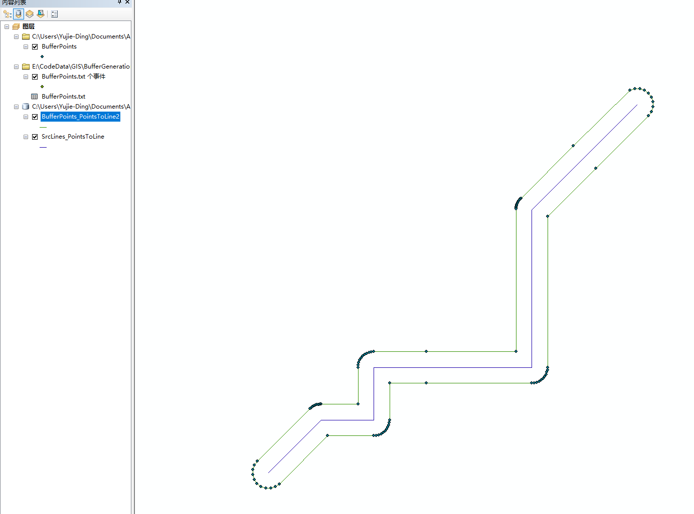
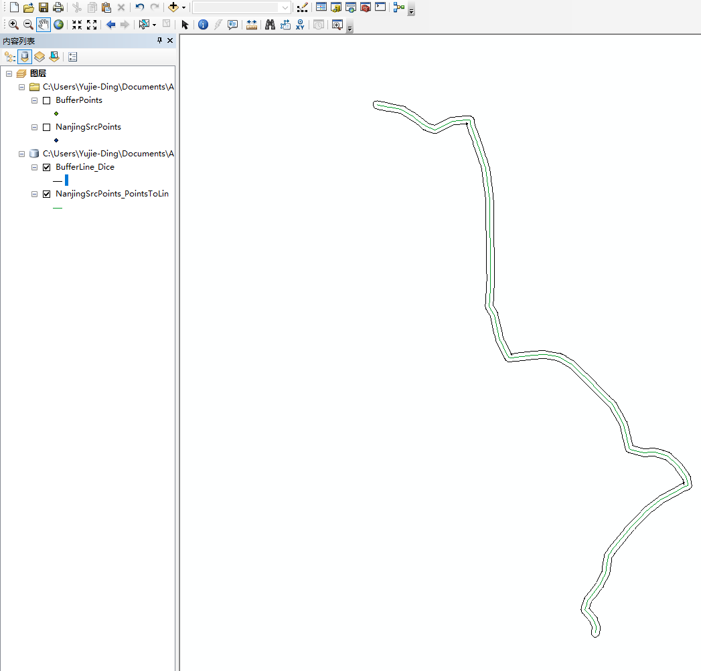
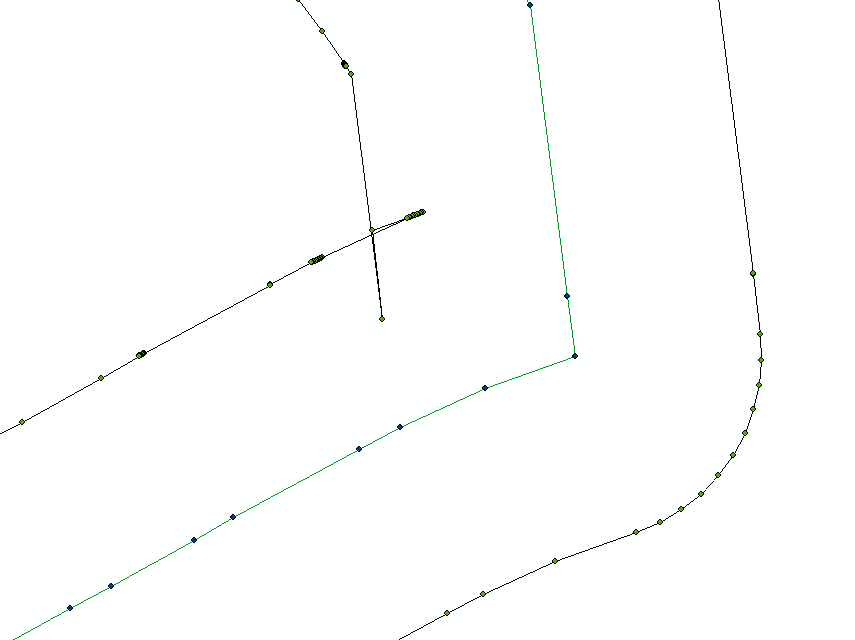

# GIS_GenerateBuffer

使用C++编写的使用凸角圆弧法生成线缓冲区的算法简单实现，不考虑重叠问题

## 简单测试

### 使用简单数据测试

使用如下数据：

    std::vector<Vector> Points;
    Points.push_back(Vector{ 3, 3 });
    Points.push_back(Vector{ 4, 4 });
    Points.push_back(Vector{ 5, 4 });
    Points.push_back(Vector{ 5, 5 });
    Points.push_back(Vector{ 6, 5 });
    Points.push_back(Vector{ 8, 5 });
    Points.push_back(Vector{ 8, 8 });
    Points.push_back(Vector{ 9, 9 });
    Points.push_back(Vector{ 10, 10 });

用以上点集组成一条多段线，然后使用算法生成结果，缓冲距离为0.3。生成的结果同样为点集，表示一条闭合的多段线：

    2.787867966,3.212132034
    2.732698043,3.13619715
    2.703693498,3.04693034
        ......
    3.823664424,4.242705098
    3.805165586,4.22812179
    3.787867966,4.212132034

将这些点集导入ArcGIS并生成线，得到结果如下：

### 使用更多数据测试

使用290个点组成多段线，生成对应的缓冲区：

## 问题

算法没有考虑内侧缓冲区重叠问题：

